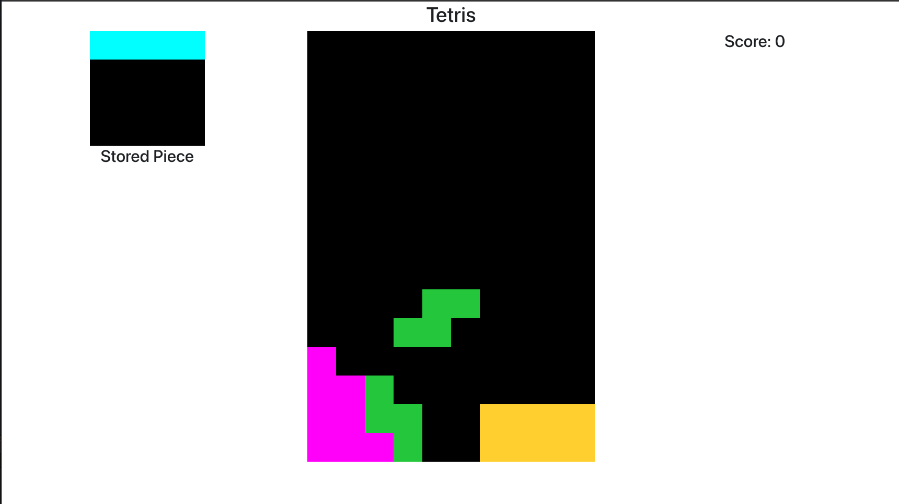

# react-tetris

This is a version of Tetris built using React. It is a simple implementation of the game, with the ability to move and rotate the pieces, and to clear lines. The game is over when the pieces reach the top of the board.

The game can be played with keyboard arrow keys. The controls are as follows:

- Left arrow: move the piece to the left
- Right arrow: move the piece to the right
- Down arrow: move the piece down one row
- Up arrow: immediately drop the piece to the bottom of the board
- r: rotate the piece
- s: store the piece for later use, or swap the stored piece with the current piece

## Available Scripts

In the project directory, you can run:

### `yarn start`

Runs the app in the development mode.\
Open [http://localhost:3000](http://localhost:3000) to view it in your browser.

The page will reload when you make changes.\
You may also see any lint errors in the console.

### `yarn test`

Launches the test runner in the interactive watch mode.\
See the section about [running tests](https://facebook.github.io/create-react-app/docs/running-tests) for more information.

### `yarn build`

Builds the app for production to the `build` folder.\
It correctly bundles React in production mode and optimizes the build for the best performance.

The build is minified and the filenames include the hashes.\
Your app is ready to be deployed!

See the section about [deployment](https://facebook.github.io/create-react-app/docs/deployment) for more information.
